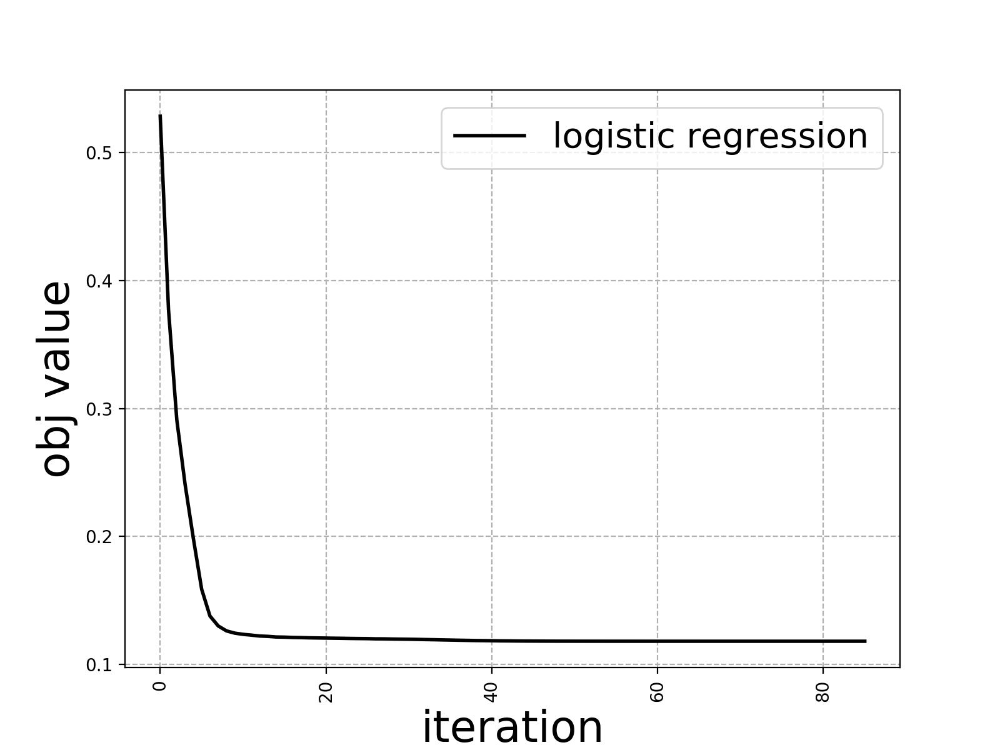

# cs651 Project - Stack Overflow dataset
<h2>Abstract</h2>

This project investigates the Stack Overflow dataset obtained from the public dataset repository available on Google Cloud. It shows if there is a relationship between 10 specific features provided in the dataset and whether the question posted was answered or not. These 10 features with respect to a question post include, title, body, creation date, answer count, favourite count, score, tags, view count, reputation of the user that posted the question, and vote type.

<h2>Three Main Steps</h2>

<h3>Data cleaning and staging</h3>

We used dataframes and spark SQL function to perform most of our data processing

<h3>Data Normalization and Standardization</h3>

We used MinMaxScaler and CountVectorizer methods to normalize the data. And perform naive NLP approach to extract key words from features 'body' and 'title' using RegexTokenizer and StopWordsRemover

<h3>Data Mining</h3>

Built a simple pipeline using the spark MLlib library. The loss function we chose is logistic regression with parameter lambda 0.01 and l2 regularization

<h2>Result</h2>

The model performed very well in predicting the labels with an accuracy of approximately 97%. the mean absolute error is around 0.1195, which is very good. Interestingly, the true positive rate for label 0 (unanswered questions) was approximately close to 100% while for label 1 (answered questions), it was around 88%. This 10% gap may be due to the fact that label 0 had 4 times as many rows of data as label 1. This imbalance in data may have over trained the label 0 class causing the model to think that the best thing to do is to always predict label 0, thus the extremely high accuracy. It is very likely that the model is predicting label 0 class regardless of the data that it should be predicting for.

<h2>Classifiers</h2>

<h3>Logistic Regression:</h3>

|                 FPR|                TPR|  
| ------------------ |:-----------------:| 
|                 0.0|                0.0|  
|                 0.0|0.06675203838485354|  
|                 0.0|0.11160461007278209|  
|                 0.0|0.15645718176071063|  
|                 0.0| 0.2013097534486392|  
|                 0.0|0.24616232513656774|  
|                 0.0|0.29101489682449627|  
|                 0.0| 0.3358674685124248|  
|                 0.0| 0.3807200402003534|  
|                 0.0|0.42557261188828194|  
|                 0.0| 0.4704251835762105|  
|                 0.0|  0.515277755264139|  
|                 0.0| 0.5601303269520675|  
|                 0.0| 0.6049828986399961|  
|                 0.0| 0.6498354703279247|  
|                 0.0| 0.6946880420158532|  
|                 0.0| 0.7395406137037818|  
|2.300881697866622...| 0.7843121362921658|  
|7.362821433173192E-5| 0.8290026097810054|  
|6.488486387983875E-4| 0.8719586325395925|  

**areaUnderROC**: 0.9917055784173834  

False positive rate by label:  
label 0: 0.11847757371415604  
label 1: 0.0011780514293077107  
True positive rate by label:  
label 0: 0.9988219485706923  
label 1: 0.881522426285844  
Precision by label:  
label 0: 0.9674230369805804  
label 1: 0.9953146162011787  
Recall by label:  
label 0: 0.9988219485706923  
label 1: 0.881522426285844  
F-measure by label:  
label 0: 0.9828717886018715  
label 1: 0.9349689243438868  

**Accuracy**: 0.9728852074738619  
**FPR**: 0.09254083261732567  
**TPR**: 0.972885207473862  
**F-measure**: 0.9722797234011383  
**Precision**: 0.9735902971273835  
**Recall**: 0.972885207473862  

**Test Error**
the mean absolute error is  0.11983125080510112  

